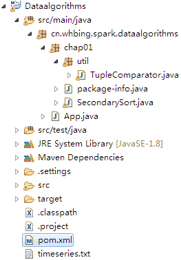

# 1 说明

本文档介绍**Spark的二次排序解决方案**。

## 1.1 Chapter 01: Secondary Sorting With Spark

**输入格式**

每一条记录（行）格式如下
```java
<key><,><time><,><value>
```
假设`key`已经有序，对`key`分组，对`time`排序

**输入数据**
```shell
$ cat time_series.txt 
p,4,40
p,6,20
x,2,9
y,2,5
x,1,3
y,1,7
y,3,1
x,3,6
z,1,4
z,2,8
z,3,7
z,4,0
p,1,10
p,3,60
```
**期望输出**
```
(z,{1=>4, 2=>8, 3=>7, 4=>0})
(p,{1=>10, 3=>60, 4=>40, 6=>20})
(x,{1=>3, 2=>9, 3=>6})
(y,{1=>7, 2=>5, 3=>1})
```

**环境**
```
spark version 2.1.2-SNAPSHOT        
Java 1.8.0_131
```
项目详细实现见如下过程，项目结构如下


添加两个依赖，其中`spark-core_2.11`，是必须的；`guava`仅仅是为了将Iterable转化为List。

```
<dependency>
    <groupId>org.apache.spark</groupId>
    <artifactId>spark-core_2.11</artifactId>
    <version>2.1.2</version>
</dependency>
	
<dependency>
  <groupId>com.google.guava</groupId>
  <artifactId>guava</artifactId>
  <version>24.1-jre</version>
</dependency>
```

```flow 
io=>inputoutput: 输入文件timeseries.txt
op1=>operation: SparkConf及SparkContext
op2=>operation: ① textFile将每一行读取成->JavaRDD，即lines
op3=>operation: ② mapToPair(new PairFunction<T,K,V>) -> JavaPairRDD
op4=>operation: ③ groupByKey -> JavaPairRDD，即groups
op5=>operation: ④ mapValues->对groups中的Iterable类型的Vaule排序

io->op1->op2->op3->op4->op5
```

## 小结

 1. `textFile` --> JavaRDD
 2. `mapToPair` --> JavaPairRDD
 3. `groupByKey` -->JavaPairRDD
 4. `mapValues `-->要复制一份values再操作
 5. Iterable转List
 6. `take(n)`及`collect()`